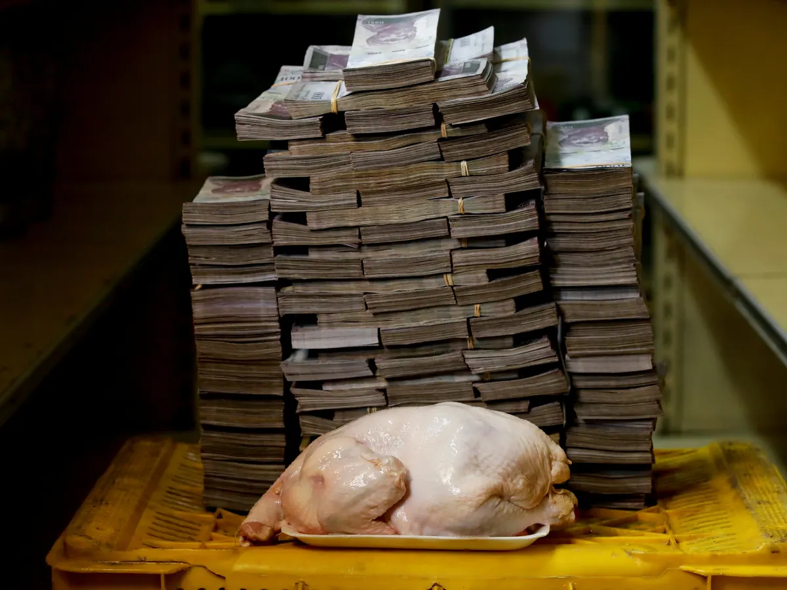

# Mid Term Project
---

14m bolivars for a chicken: Venezuela hyperinflation explained

### Problem Statement/Goal: 

##### Our paper studies the effect of US interest rates on the macroeconomic condition of the Emerging Market Economies (EMEs). The study focuses on the reaction of exchange rates, broad money aggregates, and foreign exchange reserves to changes in US monetary policy 
---

### Motivation behind the project:
##### 1. How Money Works ? what is the architecture behind the working philosophy of money ? Who are the main players responsible for designing such mechanism? 

##### 2. Once Step 1 was clear, it became evident to me raise awareness about this topic: "Inflation: The Biggest Export of the United States?" 
---

### Data: 
##### 1. For identification of the US interest rate shocks, I use the monthly dataset from 2007 to 2020 on the Industrial Production Index (IPI), Consumer Price Index (CPI), securities held outright by the Federal Reserve, and shadow interest rates of the United States.  

##### 2. I use a monthly dataset from 2007 to 2020 for a total of 3 emerging economies (Russia, India & China) and of USA to examine the spillover effects of US interest rate shocks over these EMEs. The dataset consists of:

* IPI
* CPI
* Exchange rate
* Money supply (broad money) 
* Foreign exchange reserves

Source: CEIC for collecting the data on all the variables. For 
 

---

### High-level Planning of the project, e.g:

##### -- Day 1: Strategy: matching the problem with the solution/Data Access 

#####  -- Day 2: Dataset preparation and preprocessing 

##### -- Day 3: Dataset splitting, Modeling Evaluating 

##### -- Day 4: Consolidate results and publish -- 

 

